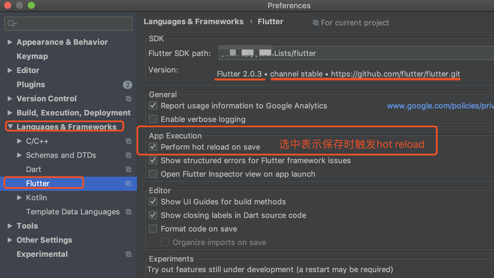
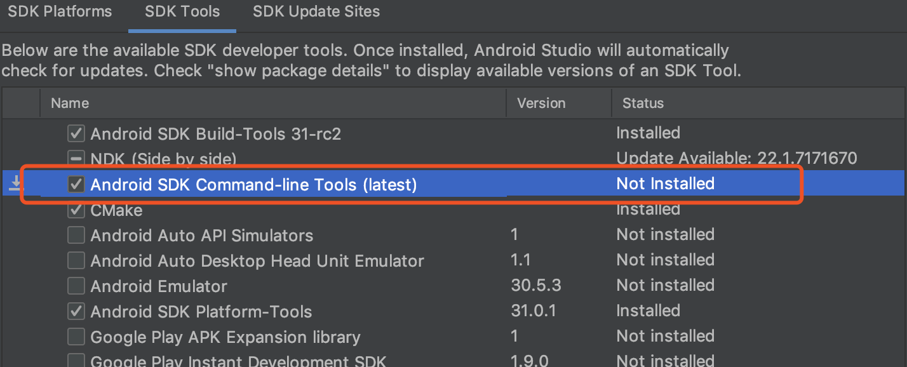

### 4、保存时执行hot reload


### 3、flutter doctor检查出现的问题
```cmd
$ flutter doctor
[!] Android toolchain - develop for Android devices (Android SDK version 29.0.3)
    X Android license status unknown.
      Try re-installing or updating your Android SDK Manager.
      See https://developer.android.com/studio/#downloads or visit https://flutter.dev/setup/#android-setup
      for detailed instructions.
```

Solution：
在Android Studio中启动SDK Manager；
去掉选项Hide Obsolete Packages；
选择安装Android SDK Tools (Obsolete)；
点击Apply；
安装完成；

然后运行` $ flutter doctor --android-licenses`，一直输入y即可。
Android SDK Tools被废弃了 但Flutter还需要其提供支持。

如果运行`--android-licenses`命令报错(并且在运行app时一直显示白屏后无反应)如下：
```
lyldeMacBook-Pro:flutter lyl$ flutter doctor --android-licenses
Exception in thread "main" java.lang.NoClassDefFoundError: javax/xml/bind/annotation/XmlSchema
	at com.android.repository.api.SchemaModule$SchemaModuleVersion.<init>(SchemaModule.java:156)
	at com.android.repository.api.SchemaModule.<init>(SchemaModule.java:75)
	at com.android.sdklib.repository.AndroidSdkHandler.<clinit>(AndroidSdkHandler.java:81)
	at com.android.sdklib.tool.sdkmanager.SdkManagerCli.main(SdkManagerCli.java:73)
	at com.android.sdklib.tool.sdkmanager.SdkManagerCli.main(SdkManagerCli.java:48)
Caused by: java.lang.ClassNotFoundException: javax.xml.bind.annotation.XmlSchema
	at java.base/jdk.internal.loader.BuiltinClassLoader.loadClass(BuiltinClassLoader.java:602)
	at java.base/jdk.internal.loader.ClassLoaders$AppClassLoader.loadClass(ClassLoaders.java:178)
	at java.base/java.lang.ClassLoader.loadClass(ClassLoader.java:521)
	... 5 more
```

Solution: 打开android studio SDK Manager，选中cmd-line进行安装，完成后重启IDE `Invalidate caches/Restart`再次Run




### 2、Could not resolve io.flutter:flutter_embedding_debug
Solution: 
```
 // 添加 
 maven { url “http://download.flutter.io”}
（maven { url "https://storage.googleapis.com/download.flutter.io" }）

allprojects {
    repositories {
        google()
        jcenter()
        maven { url "http://download.flutter.io"}
    }
}
```

### 1、helloWorld第一步出现的错误（参考第三步Android license status unknown）
编译慢。
```
Android license status unknown.
Try re-installing or updating your Android SDK Manager.
```

Solution: sdk tools（/Users/lyl/Library/Android/sdk/tools/bin/sdkmanager）已经是废弃状态了，但flutter还是在支持中。
